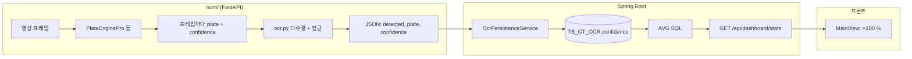

# OCR 신뢰도(confidence)와 평균 인식률

Golden Time 프로젝트에서 **번호판 인식 신뢰도**가 어디서 만들어지고, **대시보드의 평균 인식률**이 무엇을 뜻하는지 정리한 문서입니다.

---

## 1. 용어 정리

| 용어 | 의미 |
|------|------|
| **confidence** | OCR 파이프라인이 “이 인식 결과를 얼마나 확신하는지”를 0~1 근처 실수로 나타낸 값 (모델·단계마다 의미가 조금씩 다름) |
| **영상 1건의 confidence** | `num/ocr.py`가 한 영상 처리 후 JSON으로 반환하는 **`confidence` 한 필드** (아래 2절) |
| **대시보드 평균 인식률** | DB에 저장된 **모든 사건의 OCR confidence**를 평균 낸 뒤, 화면에서 **퍼센트(×100)** 로 표시한 값 |

---

## 2. 전체 흐름 (한눈에)



---

## 3. Python: confidence가 “만들어지는” 과정

### 3.1 프레임 단위 — `plate_engine_pro.py` (메인 엔진)

한 프레임에서 대략 다음이 합쳐집니다.

1. **YOLO (번호판/차량 탐지)**  
   - Ultralytics가 주는 **탐지 신뢰도** (`boxes`의 `conf`) — 위치가 맞을 확률에 가깝습니다.

2. **PaddleOCR 등 (`_run_ocr` → `_ocr_plate_roi`)**  
   - ROI(번호판 잘라낸 이미지)에서 읽은 **글자/라인별 신뢰도**  
   - 여러 후보가 있으면 문자열을 고른 뒤, **그 문자열에 해당하는 후보들의 confidence 평균**을 `best_conf`로 씁니다.

3. **CRNN (`_crnn_read_plate`)**  
   - 글자마다 softmax 최대 확률을 모아 **글자 신뢰도 평균**을 냅니다.

4. **프레임 결과**  
   - `process_frame`이 반환하는 리스트 항목마다 `"confidence": best_text에 대응하는 신뢰도` 형태.

**참고 코드 위치**

- ROI에서 최종 `best_conf`: `plate_engine_pro.py` — `_ocr_plate_roi` 내부 후보 집계·평균
- CRNN 문자 평균: `_crnn_read_plate` (`softmax` → 글자별 max 확률 → 평균)
- 프레임 출력: `results.append({ "plate", "confidence", ... })`

### 3.2 영상 단위 — `ocr.py`의 `recognize_plate_from_video`

- 일정 간격으로 프레임을 읽어 `process_frame`(또는 Paddle 폴백)을 호출합니다.
- 매 샘플마다 나온 `(plate 문자열, confidence)`를 **리스트에 쌓습니다**.
- **가장 많이 등장한 번호판 문자열**을 “최종 번호”로 정합니다.
- **그 번호와 짝이 맞는 confidence만** 골라 **산술평균** → API 응답의 **`confidence`**.

```text
영상 1건 JSON = {
  "detected_plate": "<다수결로 고른 번호판>",
  "confidence": "<그 번호에 대한 프레임별 confidence 평균>"
}
```

**폴백:** `PlateEnginePro`를 못 쓰면 PaddleOCR만 쓰고, 이때도 Paddle이 주는 `(text, conf)`의 `conf`를 동일하게 쌓습니다.

---

## 4. Spring Boot: 저장과 “평균 인식률” API

| 단계 | 파일 | 설명 |
|------|------|------|
| OCR 응답 저장 | `OcrPersistenceService.java` | `confidence` → 엔티티 `GtOcr`의 `confidence` (Float) |
| 테이블 | `GtOcr.java` / `TB_GT_OCR` | 사건(`GtEvent`)당 OCR 1건에 대응되는 행 |
| 전체 평균 | `GtOcrRepository.java` | `SELECT AVG(o.confidence) FROM GtOcr o` |
| 통계 DTO | `DashboardService.java` + `DashboardStatsDto.java` | 위 평균을 `averageConfidence`로 내보냄 |
| REST | `DashboardApiController.java` | `GET /api/dashboard/stats` |

즉 **대시보드 숫자 = DB에 들어 있는 모든 OCR `confidence`의 평균**입니다. (영상 1건 안의 프레임 평균이 아니라, **사건 단위로 저장된 값들**의 평균입니다.)

---

## 5. 프론트엔드: 퍼센트 표시

| 파일 | 내용 |
|------|------|
| `golden/golden/src/store/data.js` | `fetchStats()` → `/api/dashboard/stats` |
| `golden/golden/src/views/MainView.vue` | `averageConfidence`(0~1 가정) × **100** → `번호판 인식 모델 정확도` 카드에 `%` 표시 |

---

## 6. 요약 문장 (발표/보고용)

- **한 영상 처리:** 프레임마다 모델이 주는 신뢰도를 모았다가, 최종으로 정한 번호판에 대해서만 다시 평균 낸 값이 **`confidence`** 이다.
- **대시보드 평균 인식률:** 그렇게 저장된 **사건별 OCR 신뢰도**를 DB에서 **전체 평균**한 뒤, 화면에서 퍼센트로 보여준다.

---

## 7. 관련 파일 목록

| 구분 | 경로 |
|------|------|
| OCR 서버 진입 | `num/server.py` |
| 영상 → JSON | `num/ocr.py` |
| 고정밀 인식 엔진 | `num/plate_engine_pro.py` |
| 설정 | `num/config.py` |
| DB 저장 | `goldentime/.../OcrPersistenceService.java` |
| 평균 쿼리 | `goldentime/.../GtOcrRepository.java` |
| 대시보드 UI | `golden/golden/src/views/MainView.vue` |

이 문서는 구현 세부가 바뀔 수 있으므로, 수치·임계값은 코드와 함께 확인하는 것이 좋습니다.
